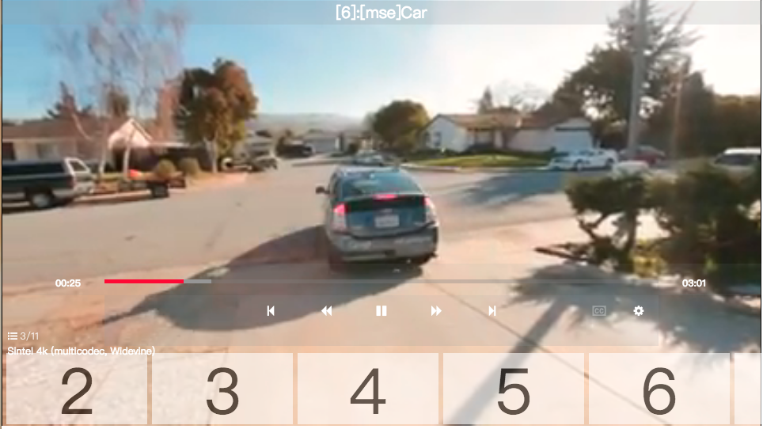

# Dashjs-Player-jQuery-Plugin

## Introduce
 It's a h5 video player using caph3-jquery, based on MSE/EME player named [shaka-player](https://github.com/google/shaka-player).

 UX/UI design for TV application, support remote control. 



## Getting Start

````
yarn start // start localhost:3000

yarn test // start karma to test src code.
````

## Usage

````javascript
// html
<div id="player"></div>

// app.js
var playlist = [...src];

$('#player').caphDashjsPlayer({
    datas : playlist // datas can not rename
});
````

## About

-   [CAPH3 for jQuery](https://developer.samsung.com/onlinedocs/tv/caphdocs/main.html?type=jquery&doc=demo&p1=0)
-   [shaka-player](https://github.com/google/shaka-player)
-   [dash.js](https://github.com/Dash-Industry-Forum/dash.js)